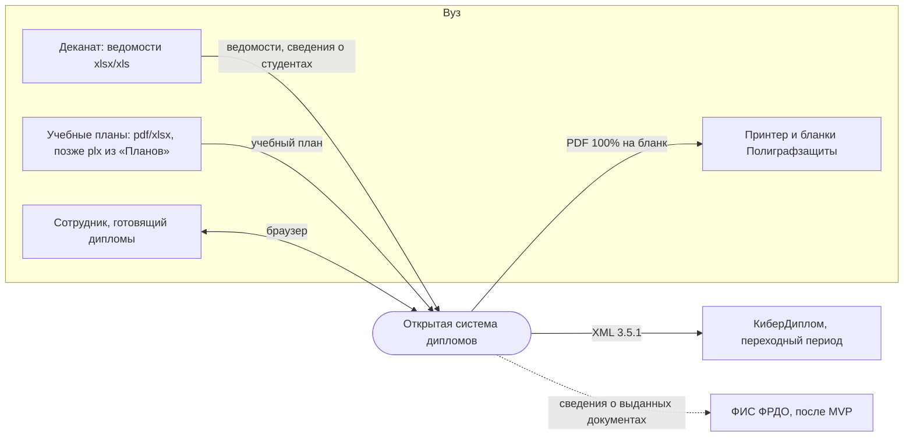
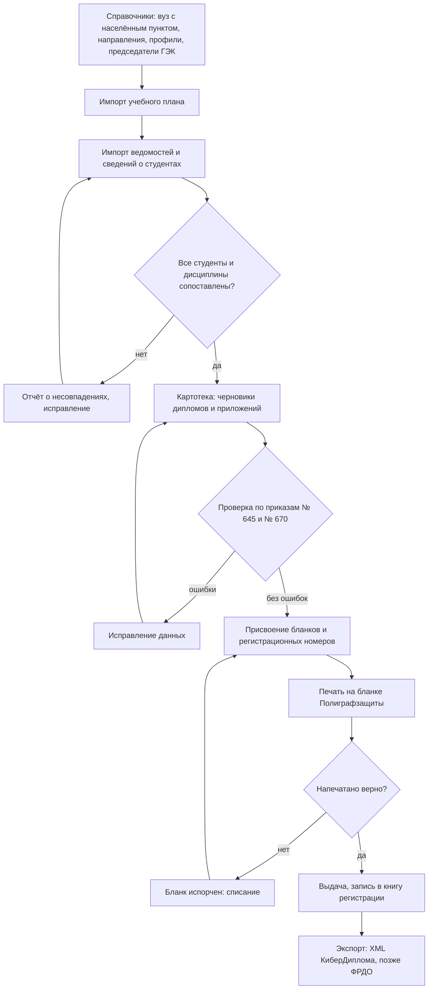
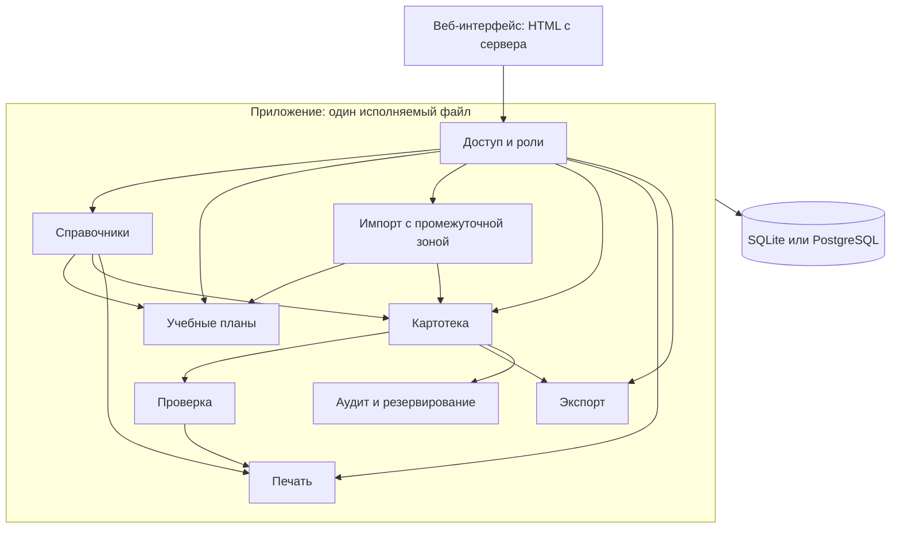
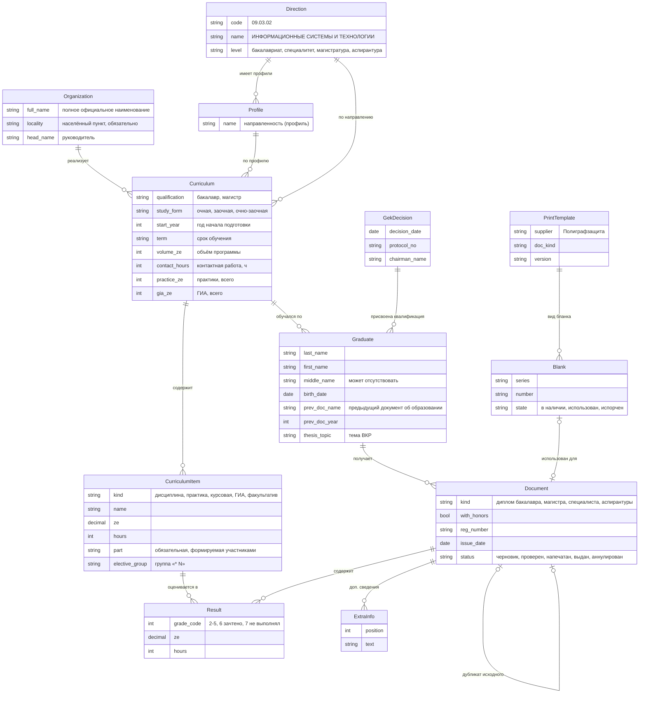
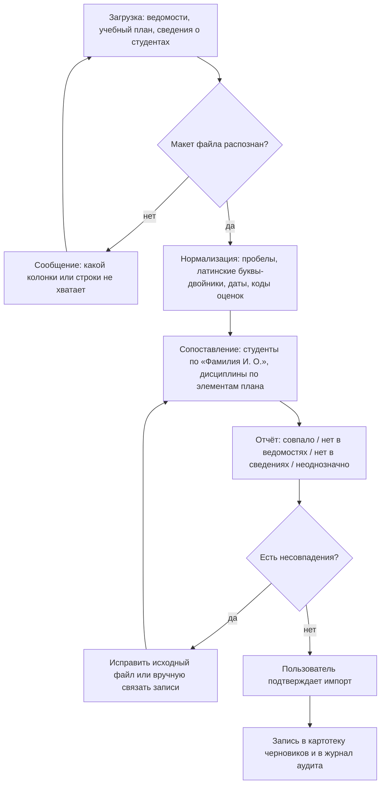
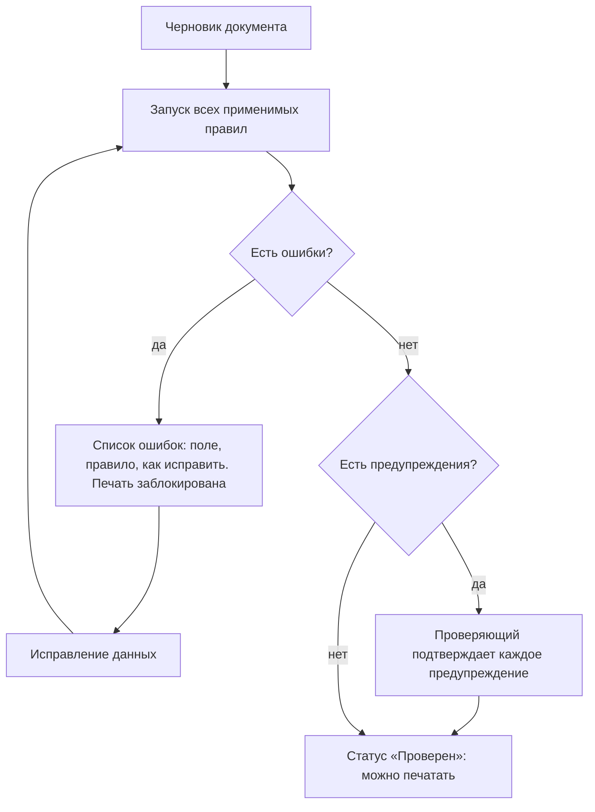
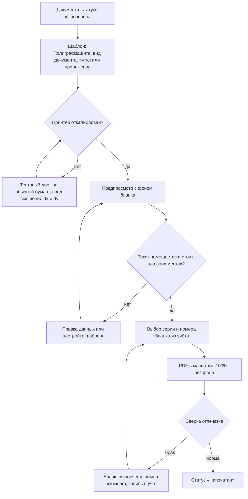
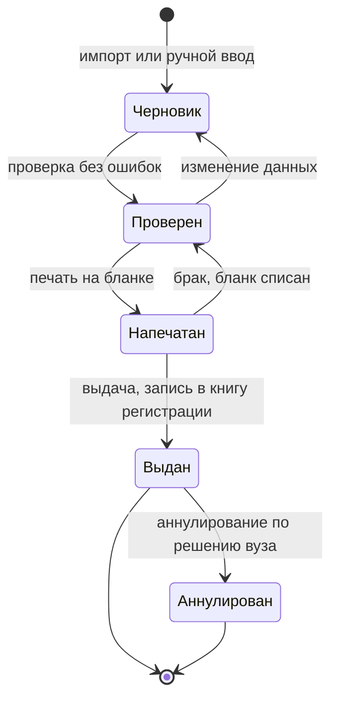
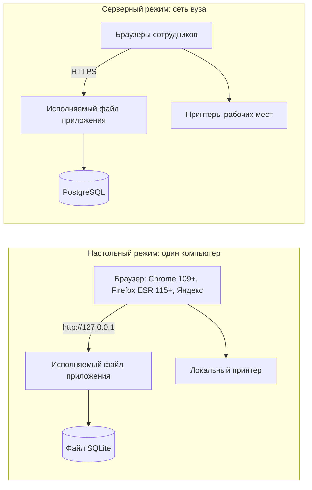

# Архитектура открытого аналога КиберДиплома

Статус: **черновик для обсуждения**, 25.09.2026. Технологический стек здесь сознательно не выбран — это следующий этап (раздел 12).

## 1. Назначение

Открытая система для подготовки, проверки, печати и учёта документов о высшем образовании: дипломов и приложений к ним. Цель — заменить КиберДиплом (Cybertronix) в вузе и дать возможность развернуть систему как на старых, так и на новых компьютерах.

Сейчас процесс в ПГТУ выглядит так: деканатские ведомости и учебный план обрабатываются этим репозиторием (`diploma_supplement_service`) в сводную таблицу и XML «ФайлОбменаКиберДиплом» 3.5.1; XML импортируется в КиберДиплом; там вручную добавляются данные документа (регистрационный номер, дата выдачи, бланк) и организации, после чего документы печатаются по шаблонам FastReport (`.fr3`) на бланках типографии.

Недостатки текущей схемы: закрытая платная программа с USB-ключом и зашифрованной базой (`.davf`), ручные шаги между системами, ошибки, которые не ловит ни одна из сторон (см. [BACKLOG.md](../BACKLOG.md), B-01, B-25, B-26), и три рантайма в Docker, которые не устанавливаются на рабочие места.

## 2. Требования, задающие архитектуру

| № | Требование | Источник |
|---|---|---|
| R1 | Одна сборка, два режима: одиночный ПК без сети и сервер вуза для многих пользователей | решение заказчика |
| R2 | Платформы: Windows 7/8.1 (в том числе 32-битные), Windows 10/11, Astra Linux, РЕД ОС, Альт | решение заказчика |
| R3 | Docker и предустановленные рантаймы не требуются | следствие R2 |
| R4 | MVP: картотека выпускников с проверкой, импорт ведомостей и учебного плана, экспорт XML в КиберДиплом на переходный период, печать на бланках | решение заказчика |
| R5 | Первый бланк для печати — типография «Полиграфзащита» (Ижевск) | решение заказчика |
| R6 | Соответствие приказам Минобрнауки России № 645 (образцы) и № 670 (порядок заполнения, учёта и выдачи, действует до 01.09.2028) | законодательство |
| R7 | Ни одна запись не теряется молча; каждое расхождение показывается пользователю | уроки выпуска 2026 |
| R8 | Персональные данные хранятся только в инсталляции вуза (152-ФЗ); в открытом репозитории — только синтетические данные | законодательство |
| R9 | Интерфейс и сообщения на русском | заказчик |
| R10 | После MVP: выгрузка в ФИС ФРДО, другие типографии | план развития |

## 3. Контекст системы

## 4. Сквозной функциональный процесс

От ведомости до выданного диплома. Каждый ромб — точка, где система останавливается и показывает расхождение, а не продолжает молча (R7).

## 5. Архитектурный стиль

**Модульный монолит, «локальный веб»** ([ADR-0001](adr/0001-modular-monolith-local-web.md)).

- Один исполняемый файл содержит веб-сервер, всю бизнес-логику и шаблоны страниц.
- **Настольный режим:** слушает только `127.0.0.1`, хранит данные в одном файле SQLite рядом с программой, при запуске открывает браузер. Сеть не нужна.
- **Серверный режим:** тот же файл слушает сеть вуза, данные в PostgreSQL, включены учётные записи и роли.
- Режим выбирается в конфигурационном файле; код один.
- Интерфейс — HTML, собранный на сервере, с минимальным JavaScript. Должен работать в Chrome 109 и Firefox ESR 115 (последние версии для Windows 7), в «Яндекс Браузере» и в браузерах российских Linux.

Почему не микросервисы в Docker, как сейчас: Docker нет на Windows 7 и 32-битных системах, а в закрытых контурах Astra Linux его обычно запрещено ставить. Почему не «толстое» настольное приложение: кроссплатформенный нативный интерфейс для Windows 7 (32 бит) и Astra дорог в разработке и не даёт серверного режима.

## 6. Модули

| Модуль | Отвечает за | Ключевые правила |
|---|---|---|
| Справочники | организация, направления подготовки, профили, квалификации, формы обучения, председатели ГЭК, шкала оценок, типографии и виды бланков | у организации обязательны полное наименование и населённый пункт (D-03); направление и профиль — разные справочники (D-02) |
| Учебные планы | шапка плана (направление, профиль, квалификация, форма, год начала, срок обучения, объёмы) и его элементы: дисциплины, практики, курсовые, ГИА, факультативы, з.е., часы, части плана, элективные группы «* N» | план — единственный источник названий дисциплин и з.е. для приложения |
| Импорт | адаптеры входных форматов: ведомости «Деканата», учебный план, сведения о студентах, XML КиберДиплома 3.5.1; промежуточная зона и отчёт о сопоставлении ([ADR-0004](adr/0004-import-staging-area.md)) | ничего не пишется в картотеку без подтверждения пользователя |
| Картотека | выпускники, документы (титул и приложение), результаты по элементам плана, решения ГЭК, дополнительные сведения | выданный документ не изменяется; дубликат — новый документ со ссылкой на исходный |
| Проверка | набор правил, их уровень (ошибка или предупреждение) и отчёт | ошибка блокирует печать и финальный экспорт |
| Печать | шаблоны бланков в миллиметрах, калибровка принтеров, формирование PDF, учёт бланков строгой отчётности ([ADR-0003](adr/0003-printing-mm-templates.md)) | печать только проверенных документов; номер бланка используется один раз |
| Экспорт | XML «ФайлОбменаКиберДиплом» 3.5.1, книга регистрации (xlsx/pdf); позже ФИС ФРДО ([ADR-0005](adr/0005-cyberdiploma-xml-compat.md)) | экспорт документов со статусом не ниже «проверен» |
| Аудит и резервирование | журнал изменений (кто, что, когда, старое и новое значение), резервные копии | журнал только дополняется |
| Доступ и роли | настольный режим — один пользователь (по желанию с паролем); серверный — оператор, проверяющий, администратор; позже LDAP/AD | проверяющий не может подтвердить собственные правки (принцип четырёх глаз, настраивается) |

## 7. Модель данных

Сущности выведены из полей шаблонов Полиграфзащиты (`.fr3`), тегов XML 3.5.1 и шапок учебных планов. Имена сущностей латиницей, чтобы их можно было перенести в код без переименования.

Коды оценок КиберДиплома (D-01): 2–5 — оценки, 6 — «зачтено», 7 — «не выполнял». Код 7 допустим только в черновике. На бланк оценки выводятся прописью.

### Соответствие полей шаблонов Полиграфзащиты модели

| Поле шаблона `.fr3` | Где в модели |
|---|---|
| `Образовательное учреждение`: Наименование, Местонахождение, Руководитель (Ф, И, О) | `Organization.full_name`, `Organization.locality`, `Organization.head_name` |
| `Студент`: Фамилия, Имя, Отчество, Дата рождения | `Graduate` |
| `Студент`: Предыдущий документ (наименование, год) | `Graduate.prev_doc_name`, `Graduate.prev_doc_year` |
| `Студент`: Специальность (код, наименование) | `Direction.code`, `Direction.name` — **не профиль** (B-25) |
| `Студент`: Квалификация, Срок обучения | `Curriculum.qualification`, `Curriculum.term` |
| `Студент`: Дата решения и номер протокола ГЭК, Председатель (Ф, И, О) | `GekDecision` |
| `Документ`: Регистрационный номер, Дата выдачи, С отличием, Дубликат (диплома, приложения) | `Document` (дубликат — ссылка на исходный документ) |
| `Модули и разделы`: Наименование, Трудоёмкость / Количество часов, Оценка | `CurriculumItem` + `Result` |
| `Курсовые работы`: Наименование, Оценка | `CurriculumItem(kind = курсовая)` + `Result` |
| `Дополнительные сведения`: Наименование | `ExtraInfo` (в том числе «Направленность (профиль) образовательной программы: …», «Форма обучения: …») |

Данных `Документ` и `Образовательное учреждение` нет в XML 3.5.1: сейчас их вводят вручную в КиберДипломе, в новой системе они хранятся в картотеке и справочниках.

## 8. Функциональные схемы модулей

### 8.1. Импорт через промежуточную зону

Логика разбора ведомостей переносится из текущего `python-engine/app/parser.py` (макет «Деканата», «V» → 6, часы → з.е., практики, элективы, курсовые, группы «* N») вместе с тестами, с исправлением B-02…B-05, B-21…B-23.

### 8.2. Проверка документа

Группы правил (каждое правило имеет код, уровень и ссылку на пункт приказа):

- **обязательные поля:** ФИО, дата рождения, предыдущий документ, направление, квалификация, решение ГЭК, населённый пункт организации;
- **смысловые:** направление ≠ профиль; код направления соответствует уровню (`.03.` — бакалавриат, `.04.` — магистратура, `.05.` — специалитет);
- **форматы:** даты в допустимом диапазоне, год из четырёх цифр, отсутствие `nan`/`NaT` и пустых строк вместо значений;
- **оценки:** только коды 2–7; код 7 — ошибка на этапе печати; оценка есть у каждого обязательного элемента плана;
- **объёмы:** сумма з.е. результатов и объём программы по плану;
- **учёт:** уникальность регистрационного номера и номера бланка;
- **качество текста:** смешение латиницы и кириллицы, двойные пробелы, длина строк, превышающая поле шаблона.

### 8.3. Печать на бланке

Шаблон описывает страницы (титул — A4 альбомная 297×210 мм; приложение — 4 страницы A3 альбомные 420×297 мм) и поля в миллиметрах: координаты, шрифт, выравнивание, перенос, ужатие и перетекание таблицы дисциплин между страницами. Первые шаблоны — Полиграфзащита: титулы и приложения бакалавра, специалиста, магистра, аспирантуры, перенесённые из `.fr3` (координаты FastReport в пикселях при 96 dpi, 1 мм = 3,7795 пикселя).

### 8.4. Жизненный цикл документа

Дубликат диплома или приложения — новый документ в статусе «Черновик» со ссылкой на исходный; исходный не изменяется. Бланки учитываются отдельно как документы строгой отчётности: «в наличии» → «использован» или «испорчен».

## 9. Развёртывание

| Платформа | Поставка |
|---|---|
| Windows 7/8.1, 32 и 64 бит | переносимый архив или установщик: один исполняемый файл, папка данных, ярлык |
| Windows 10/11 | то же, 64 бит |
| Astra Linux, Альт | пакет `.deb` / `.rpm` соответственно, служба systemd для серверного режима |
| РЕД ОС | пакет `.rpm`, служба systemd |
| Сервер | тот же пакет плюс PostgreSQL; HTTPS через встроенный TLS или обратный прокси |

PDF формируется на сервере или локально и печатается из браузера. Нужна инструкция «печатать в масштабе 100% (фактический размер)» и калибровка для каждого принтера.

## 10. Атрибуты качества

| Атрибут | Мера |
|---|---|
| Корректность | ни одного молчаливого пропуска записи; каждое расхождение в отчёте импорта или проверки |
| Переносимость | запуск без установки рантаймов на всех платформах из R2 |
| Точность печати | отклонение текста от поля бланка не более 0,5 мм после калибровки |
| Прослеживаемость | для любого значения в документе видно, откуда оно пришло (файл, строка) и кто его менял |
| Простота установки | настольный режим: распаковать и запустить; без администратора Windows, где возможно |
| Производительность | выпуск в несколько сотен человек импортируется и проверяется за секунды на ПК 2012 года |
| Сохранность | резервная копия одним действием; в настольном режиме — копия файла БД |

## 11. Риски

| Риск | Что делаем |
|---|---|
| В Astra Linux при замкнутой программной среде запускаются только подписанные файлы | выяснить процедуру подписи и включить её в сборку; инструкция для администраторов |
| Точность печати на разных принтерах; браузер масштабирует PDF | калибровка dx/dy на каждый принтер, тестовый лист, инструкция «100%» |
| Старые инструменты сборки для Windows 7 без обновлений безопасности | учесть при выборе стека; в настольном режиме нет сетевого доступа извне |
| Лицензии шаблонов `.fr3` и шрифта Times New Roman | шаблоны каждый вуз импортирует сам, в репозиторий не кладём; шрифт по умолчанию — PT Astra Serif (свободный, метрически совместим с Times New Roman) |
| Изменение нормативной базы (порядок № 670 действует до 01.09.2028) | правила проверки и шаблоны версионируются и привязаны к дате выдачи |
| Персональные данные (152-ФЗ) | хранение только у вуза, роли, журнал, резервные копии; в открытом репозитории только синтетические данные (см. B-08) |
| Нельзя перенести историю из КиберДиплома: база `.davf` зашифрована | переносим только новые выпуски; при необходимости — ручной ввод или XML 3.5.1 ([ADR-0005](adr/0005-cyberdiploma-xml-compat.md)) |
| Архивные PDF содержат ошибки (B-27) | эталонные данные для тестов готовим и сверяем вручную |

## 12. Переход от текущего сервиса

1. **Сейчас:** текущий сервис продолжает работать; исправляются P0 из [BACKLOG.md](../BACKLOG.md) (B-01, B-04, B-06, B-25), в КиберДипломе заполняется «Местонахождение» (B-26).
2. **MVP новой системы:** справочники, учебные планы, импорт (логика `parser.py` с тестами), картотека, проверка, экспорт XML 3.5.1. КиберДиплом ещё печатает.
3. **Печать:** шаблоны Полиграфзащиты. Один выпуск печатается параллельно в обеих системах, отпечатки сравниваются.
4. **После MVP:** ФИС ФРДО, другие типографии, импорт `.plx` из «Планов», LDAP/AD.

Что переиспользуется из этого репозитория: правила разбора ведомостей (`python-engine/app/parser.py`), сопоставление с учебным планом, формат XML 3.5.1 (`python-xml-engine/app/xml_generator.py`), тесты как спецификация поведения.

## 13. Следующий этап: выбор стека

Решение не принято. Кандидат обязан:

- собираться под Windows x86 и x64 с запуском на Windows 7 и под Linux x64 со старой glibc (Astra Linux 1.7);
- работать без установки рантайма и без Docker (один файл или рантайм внутри поставки);
- формировать PDF с точным позиционированием в миллиметрах и встраиванием кириллических шрифтов;
- читать xlsx **и xls**, разбирать XML;
- работать с SQLite и PostgreSQL через общий слой;
- отдавать интерфейс, совместимый с Chrome 109 и Firefox ESR 115.

Кандидаты для сравнения: Go (версия 1.20 — последняя с Windows 7 — или сборки сообщества с её поддержкой), Java 8/11 со встроенным JRE (опыт команды, Apache POI, PDFBox), Python 3.8 с PyInstaller, Free Pascal/Lazarus. Проверка — одинаковый пробный прототип (HTTP-сервер, SQLite, чтение xlsx/xls, PDF с полем по координатам в мм) в виртуальных машинах Windows 7 (32 бит) и Astra Linux.

## 14. Записи архитектурных решений

| № | Решение | Статус |
|---|---|---|
| [0001](adr/0001-modular-monolith-local-web.md) | Модульный монолит «локальный веб», один исполняемый файл, два режима | предложено |
| [0002](adr/0002-storage-sqlite-postgresql.md) | Хранение: SQLite в настольном режиме, PostgreSQL в серверном | предложено |
| [0003](adr/0003-printing-mm-templates.md) | Печать: PDF из шаблонов в миллиметрах, калибровка, импорт `.fr3`, первый бланк — Полиграфзащита | предложено |
| [0004](adr/0004-import-staging-area.md) | Импорт через промежуточную зону с отчётом о сопоставлении | предложено |
| [0005](adr/0005-cyberdiploma-xml-compat.md) | Совместимость с КиберДипломом только через XML 3.5.1 | предложено |
| [0006](adr/0006-target-platforms-no-docker.md) | Целевые платформы и отказ от Docker как требования | предложено |
